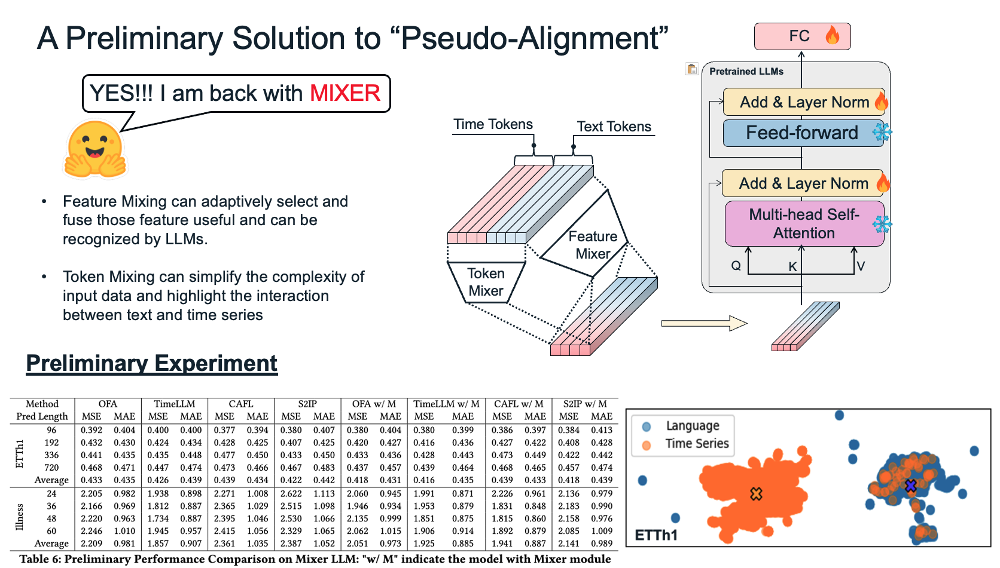

# This is Official Repository: Understanding Why Large Language Models Can Be Ineffective in Time Series Analysis: The Impact of Modality Alignment


This paper has been accepted by KDD2025 Research Track. We encourage all to see paper on [Arxiv Version](https://arxiv.org/abs/2410.12326) as the arxiv version provide additional appendix with solid experiments and visualization. 


# Overview
In this work, we showed that the reason of LLMs suffers from "Pseudo-Alignment" problem, which is a condition in which the statistical means (e.g., centroids) of different modality distributions appear aligned in a shared latent space, while the full distributions themselves, particularly their variances and higher-order structures, remain misaligned. This phenomenon is **commonly observed** in many LLM4TS models and datasets, which misdirect the LLM from understanding of time series pattenr. In addition, we emperically found that LLMs can still capture the temporal relationship of time series but not as strong as simpler method. The prediction performance is mainly from the internal structure of time series but not the interaction between time and text. To utilize both modalities and mitigate the "Pseudo-Alignment" problem, we proposed MLP-MIXER for time series and text tokens before the LLM backbone. 


# Dataset
We follow a comprehensive baseline [OFA](https://github.com/DAMO-DI-ML/NeurIPS2023-One-Fits-All) for dataset retrieval and implementation of dataset. We also retrieve the Classification dataset from [Time Series Classification Website](https://www.timeseriesclassification.com/).


# Experiments
The results can be reproduced by the scripts under ```[model name]/[task name]/scripts``` and the preliminary solution is only implemented for long-term forecasting task as it is not complete solution. We will keep this final solution as our next technical work.


# Preliminary Solution

We proposed a preliminary solution



# Acknowledgement
We appreciate the following github repos and website a lot for their valuable code base and datasets:

[https://github.com/DAMO-DI-ML/ICML2022-FEDformer](https://github.com/DAMO-DI-ML/ICML2022-FEDformer)

[https://github.com/thuml/Time-Series-Library](https://github.com/thuml/Time-Series-Library)

[https://github.com/gzerveas/mvts_transformer](https://github.com/gzerveas/mvts_transformer)

[https://github.com/DAMO-DI-ML/NeurIPS2023-One-Fits-All](https://github.com/DAMO-DI-ML/NeurIPS2023-One-Fits-All)

[https://github.com/KimMeen/Time-LLM](https://github.com/KimMeen/Time-LLM)

[https://github.com/Hank0626/CALF](https://github.com/Hank0626/CALF)

[https://github.com/panzijie825/s2ip-llm](https://github.com/panzijie825/s2ip-llm)

[Time Series Classification Website](https://www.timeseriesclassification.com/)
